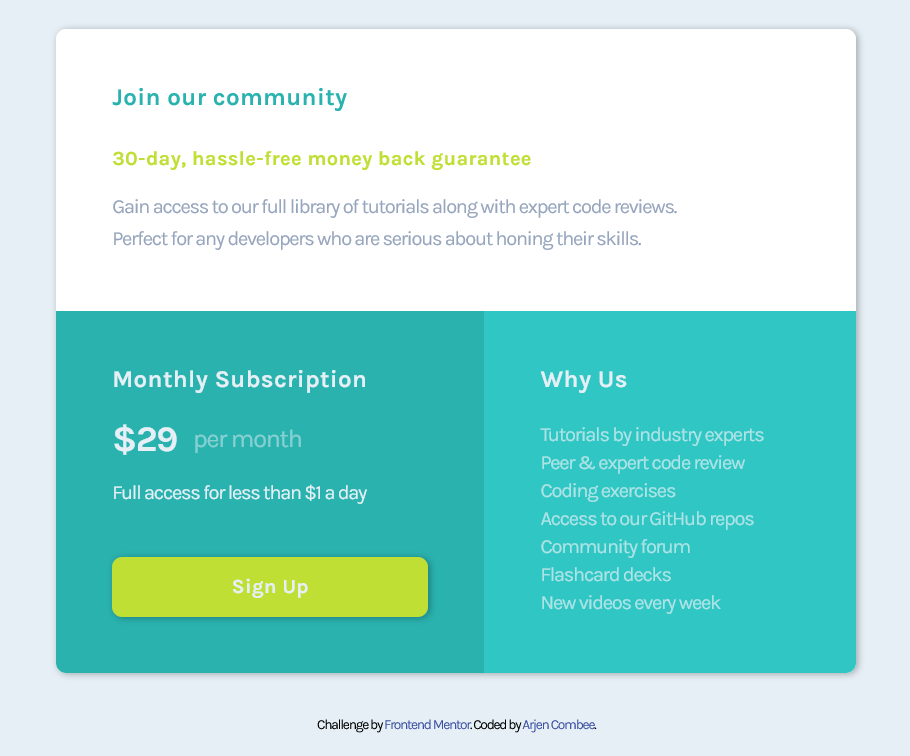

# Frontend Mentor - Single price grid component solution

This is a solution to the [Single price grid component challenge on Frontend Mentor](https://www.frontendmentor.io/challenges/single-price-grid-component-5ce41129d0ff452fec5abbbc). Frontend Mentor challenges help you improve your coding skills by building realistic projects.

## Table of contents

- [Frontend Mentor - Single price grid component solution](#frontend-mentor---single-price-grid-component-solution)
  - [Table of contents](#table-of-contents)
  - [Overview](#overview)
    - [The challenge](#the-challenge)
    - [Screenshot](#screenshot)
    - [Links](#links)
  - [My process](#my-process)
    - [Built with](#built-with)
    - [What I learned](#what-i-learned)
    - [Continued development](#continued-development)
  - [Author](#author)
  - [Acknowledgments](#acknowledgments)

## Overview

### The challenge

Users should be able to:

- View the optimal layout for the component depending on their device's screen size
- See a hover state on desktop for the Sign Up call-to-action

### Screenshot


_My destop version_

### Links

- Solution URL: [Add solution URL here](https://your-solution-url.com)
- Live Site URL: [Github Pages](https://arjencombee.github.io/004_single_price_grid/)

## My process

### Built with

- Semantic HTML5 markup
- CSS custom properties
- CSS Flexbox
- CSS Grid
- BEM methodology
- Mobile-first workflow

### What I learned

I've learned that making a layout plan for mobile and desktop before coding HTML helps 😁. In previous projects I didn't do this and got me into trouble later on.

In this project I implemented lessons learned...

_This CSS code centers the span in price element_

```css
.subscription__price {
  display: inline-flex;
  align-items: center;
  font-size: 1.8rem;
  font-weight: 700;
  line-height: 1;
}
.subscription__price span {
  font-size: 0.7em;
  font-weight: 400;
  opacity: 0.5;
  padding-left: 0.8rem;
}
```

### Continued development

This was a fun project, not as difficult as previous projects. But stil a lot of things to learn.

It is an eyopener to experience that 'coding in the wild' is something different than following a course.

Basic knowledge about HTML, CSS and JavaScript is nice to have. When I work through the projects a read extra information about some parts of the challenge. Try to extend my skills in coding.

So I'm moving forward to a new project and hope to learn new things, again.

## Author

- Website - [Arjen Combee](https://arjencombee.nl)
- Frontend Mentor - [@ArjenCombee](https://www.frontendmentor.io/profile/arjencombee)

## Acknowledgments

I want to say a big thank you to people who are responible for my **junior junior skills** in webdevelopment:

- Brad Traversy - [Traversy Media](https://www.traversymedia.com/)
- Jonas Schmedtmann - [Codingheroes](https://codingheroes.io/)
- Kevin Powell - [Kevin Powell on youtube ](https://www.youtube.com/kevinpowell)

♥ Thanks
